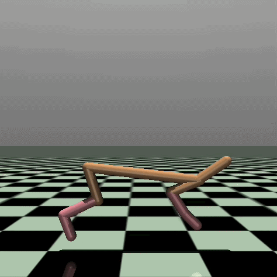
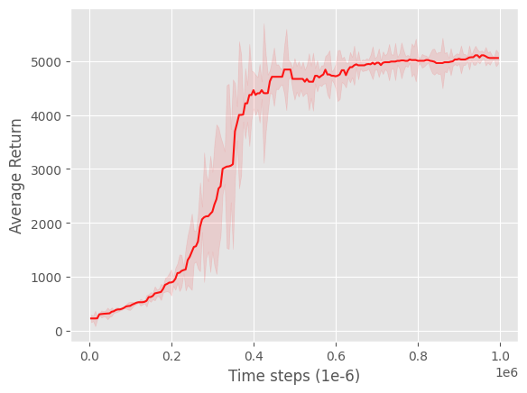
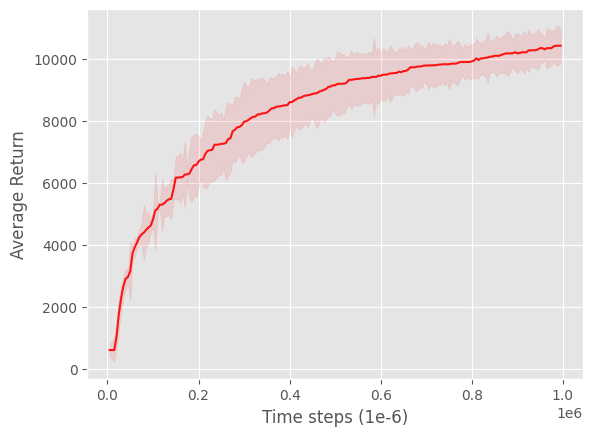
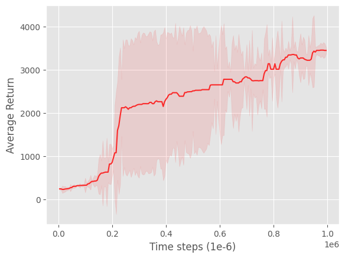
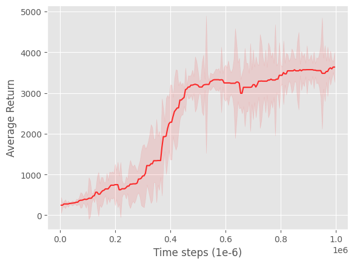
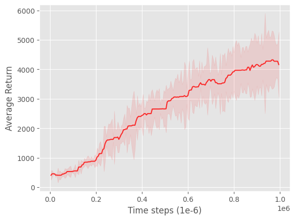
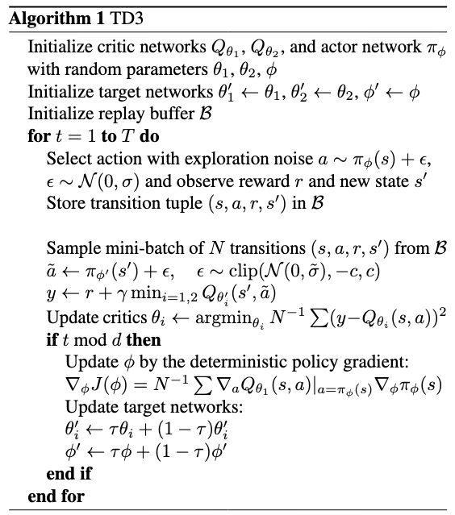
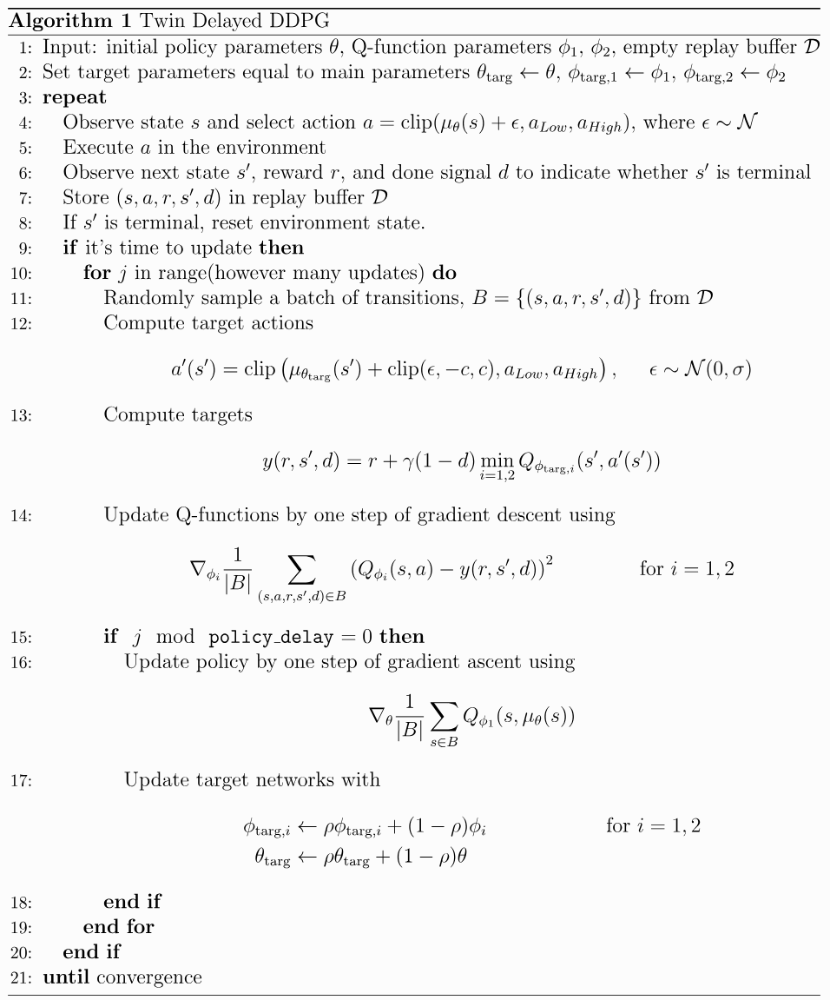
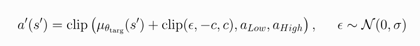
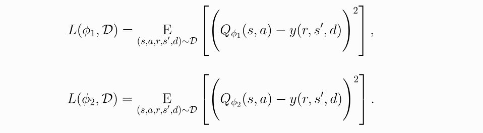

# Twin Delayed Deep Deterministic Policy Gradient (TD3)

PyTorch reimplementation of the paper ["Addressing Function Approximation Error in Actor-Critic Methods"](https://arxiv.org/abs/1802.09477) from Fujimoto et al., 2018.

| | | | | |
| -- | -- | -- | -- | -- |
|  |  |  |  |  |
|  |  |  |  |  |

Figures: Learning curves for the OpenAI Gym continuous control tasks HalfCheetah-v5, Ant-v5, Hopper-v5 and Walker2d-v5. The shaded region represents the standard deviation of the average evaluation over 10 trials across 3 different seeds. Curves are smoothed with an average filter.

## Algorithm

|                                                  |                      | 
| ------------------------------------------------ | -------------------- |
|  |  |
| *Twin Delayed Deep Deterministic Policy Gradient Algorithm (TD3). Taken from [Fujimoto et al., 2018](https://arxiv.org/abs/1802.09477).* |*Twin Delayed Deep Deterministic Policy Gradient Algorithm (TD3). Taken from [OpenAI Spinning Up](https://spinningup.openai.com/en/latest/algorithms/td3.html).*|  

TD3 makes three main changes to DDPG [(Lilicrap et al., 2015)](https://arxiv.org/abs/1509.02971):

* Target policy smoothing
* Clipped double Q-learning
* Delayed policy updates

| Target policy smoothing | Clipped double Q-learning  |          | Delayed policy updates | 
| ---------------------- | --------- | -------- | -------- |
|  | | | The policy (and target networks) are updated every $d \in \mathbb{N}$ steps (i.e. $d = 2$). |  
| *Target policy smoothing. Taken from [OpenAI Spinning Up](https://spinningup.openai.com/en/latest/algorithms/td3.html).*| TD targed and objective functions for clipped double Q-learning. Taken from [OpenAI Spinning Up](https://spinningup.openai.com/en/latest/algorithms/td3.html).* | |


## Usage

```python
import gymnasium as gym
from TD3 import TD3, ActorMLP, CriticMLP


env = gym.make("HalfCheetah-v5")
actor = ActorMLP(state_dim=17, h1_dim=400, h2_dim=300, action_dim=3)
critic = CriticMLP(state_dim=17, h1_dim=400, h2_dim=300, action_dim=3)

td3 = TD3(
    actor, 
    critic,
    timesteps=1_000_000,
    lr_actor=1e-3,
    lr_critic=1e-3,
    critic_weight_actor=0.0,
    critic_weight_decay=0.0,
    exp_noise_std=0.1, 
    tgt_noise_std=0.2, 
    noise_clip=0.5,
    gamma=0.99,
    tau=0.005,
    delay_actor=2,
    buffer_capacity=1_000_000,
    buffer_start_size=25_000,
    device="cpu"
)

td3.train(env)
```

## Experimental setup

* OS: Fedora Linux 42 (Workstation Edition) x86_64
* CPU: AMD Ryzen 5 2600X (12) @ 3.60 GHz
* GPU: NVIDIA GeForce RTX 3060 ti (8GB VRAM)
* RAM: 32 GB DDR4 3200 MHz

My hyperparameters match the hyperparameteres from the original paper. For all environment i used:

| Hyperparameter | Value |
| -------------- | ----- |
| Learning rate (actor) | 0.0003 |
| Learning rate (critic) | 0.0003 |
| $\gamma$ (discount factor)| 0.99 |
| $\tau$ (polyak averaging) | 0.005 |
| Batch size | 256 |
| Buffer capacity | 1 000 000 |
| Buffer start size| 25 000 |


## Citations

```bibtex
@misc{fujimoto2018addressingfunctionapproximationerror,
      title={Addressing Function Approximation Error in Actor-Critic Methods}, 
      author={Scott Fujimoto and Herke van Hoof and David Meger},
      year={2018},
      eprint={1802.09477},
      archivePrefix={arXiv},
      primaryClass={cs.AI},
      url={https://arxiv.org/abs/1802.09477}, 
}

@misc{lillicrap2019continuouscontroldeepreinforcement,
      title={Continuous control with deep reinforcement learning}, 
      author={Timothy P. Lillicrap and Jonathan J. Hunt and Alexander Pritzel and Nicolas Heess and Tom Erez and Yuval Tassa and David Silver and Daan Wierstra},
      year={2019},
      eprint={1509.02971},
      archivePrefix={arXiv},
      primaryClass={cs.LG},
      url={https://arxiv.org/abs/1509.02971}, 
}

@inproceedings{silver:hal-00938992,
  TITLE = {{Deterministic Policy Gradient Algorithms}},
  AUTHOR = {Silver, David and Lever, Guy and Heess, Nicolas and Degris, Thomas and Wierstra, Daan and Riedmiller, Martin},
  URL = {https://inria.hal.science/hal-00938992},
  BOOKTITLE = {{ICML}},
  ADDRESS = {Beijing, China},
  YEAR = {2014},
  MONTH = Jun,
  PDF = {https://inria.hal.science/hal-00938992v1/file/dpg-icml2014.pdf},
  HAL_ID = {hal-00938992},
  HAL_VERSION = {v1},
}
```